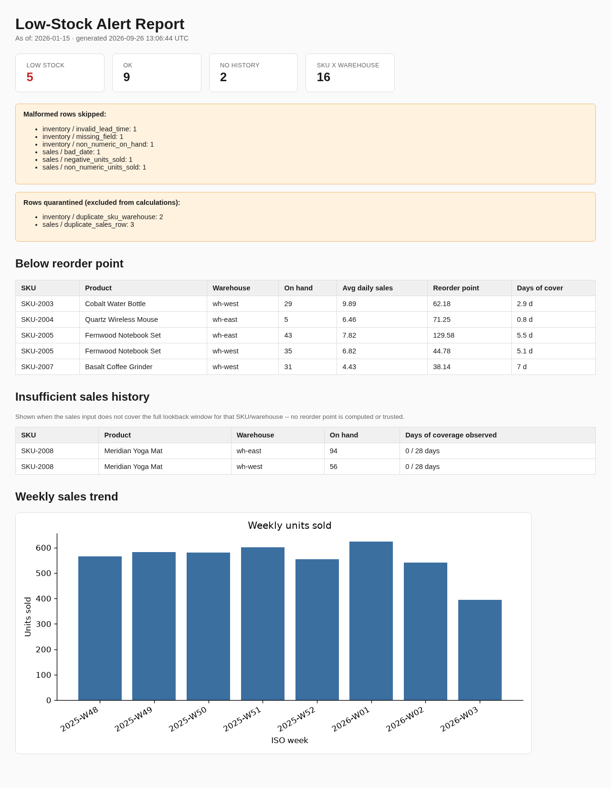
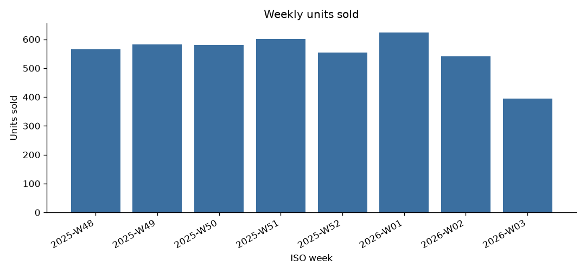

# Inventory Low-Stock Alerts

A small, self-contained demo of a common freelance job: turn a daily
inventory snapshot and sales history export into a reorder/low-stock
alert report, unattended, with validation and a weekly trend chart. All
data in this repo is **synthetic**, generated by
`data/sample/generate_sample_data.py` with a fixed seed — no real
products, customers, or company data.

## The problem this solves

A client (retailer, small manufacturer, distributor) exports two CSVs
daily — a current inventory snapshot and a rolling sales history log —
and wants, every morning, without anyone touching it:

- which SKU/warehouse combinations are below their reorder point, and by
  how much
- a defensible number for the reorder point itself, not a gut-feel
  threshold
- a weekly trend chart so a human can sanity-check demand at a glance
- confidence that malformed or duplicate rows in either file didn't
  silently corrupt the calculation
- a scheduled run that survives a slow/missing export (retry), and where a
  failed alert delivery makes the run itself fail so it gets retried
  instead of being silently swallowed

## What it does

1. **Validate** (`src/data_loader.py`): schema check on both files, type
   checks (`on_hand`, `lead_time_days`, `units_sold`) that reject
   non-numeric, non-finite (inf/NaN), and non-integer values as
   categorized bad rows rather than crashing or silently truncating, and
   duplicate detection (`sku`+`warehouse` in inventory;
   `date`+`sku`+`warehouse` in sales). Malformed rows are skipped and
   categorized (counts only); duplicates are quarantined — kept out of the
   calculation, and the full raw row is retained so the exceptions report
   shows exactly what was excluded. A present-but-empty (header-only) or
   all-invalid inventory file is treated as a **failed run**, not a clean
   "zero items" check: the CLI fires a critical alert, exits non-zero, and
   the HTML report itself carries a visible "no data" banner rather than
   silently looking like a successful check with nothing to report.
2. **Compute reorder points** (`src/reorder.py`):
   `reorder_point = avg_daily_sales * lead_time_days + safety_stock`, with
   `safety_stock = Z * stdev(daily_sales) * sqrt(lead_time_days)` — see
   "How the numbers are computed" below. A SKU/warehouse is only given a
   trusted `LOW`/`OK` status when the sales input contains a row for
   **every day** of the lookback window (default 28) for that
   SKU/warehouse. Partial coverage — even two positive-sales days out of
   28 — is reported as `NO_HISTORY`, never `OK`: "no row for a day" is not
   assumed to mean "zero sales that day," so a partial window is not
   silently treated as a complete one. The report shows the exact
   `observed_days / required_days` coverage for every `NO_HISTORY` SKU.
3. **Flag demand outliers**: a sales day far outside a SKU's own
   distribution *as of the report date* is flagged for review (kept in the
   average, not dropped). Rows dated after `as_of` are excluded from this
   analysis and from the weekly trend chart — an "as of `<date>`" report
   never uses information from after that date.
4. **Report** (`src/report.py`, `src/chart.py`): an HTML report (low-stock
   table, no-history table with coverage evidence, weekly units-sold trend
   chart) and a CSV summary of every SKU/warehouse. All CSV-derived text
   is HTML-escaped before rendering.
5. **Exceptions report**: a CSV with per-category counts for malformed
   (skipped) rows, plus outlier counts, and one row per quarantined
   duplicate with its full original data.
6. **Schedule** (`deploy/`): a cron example and a systemd service+timer
   pair, both driving `src/run_daily.sh`.
7. **Retry, locking, and delivery-failure propagation**
   (`src/run_daily.sh`, `src/alert_state.py`): the wrapper retries a
   transient failure (input not mounted yet, or a failed alert delivery)
   with backoff, and takes an exclusive `flock` so an overlapping
   *scheduled* run skips instead of racing — this lock only covers runs
   made through `run_daily.sh`; a direct `generate_report.py` invocation
   bypasses it. Alert delivery is deduplicated per `(as_of, event_id)`
   **after a successful send only**, so a rerun does not re-notify on an
   already-delivered condition, and a failed delivery is retried on the
   next run. This is **at-least-once** delivery, not exactly-once: a crash
   between sending and recording that state (or a corrupted state file,
   treated as empty rather than blocking the run) can duplicate a
   notification, and switching from the console stub to a real
   `NOTIFY_CMD` with old dedup state present can suppress that day's real
   alert until the state file is cleared.
8. **Failure alerts** (`src/alert.py`): a stub that prints the exact
   payload it would send; set `NOTIFY_CMD` to wire a real channel. The CLI
   tracks every alert's delivery result: if any fails, `generate_report.py`
   prints `PARTIAL` (not `OK`) and exits non-zero, so `run_daily.sh`'s
   retry loop retries the whole run. There is no separate outbox/queue —
   "retry" means rerunning the report generator, safe because delivery
   state is marked only on success.

## How the numbers are computed

For each SKU/warehouse, over the trailing `lookback_days` (default 28):

```
avg_daily_sales   = mean(daily units sold)
safety_stock      = Z * stdev(daily units sold) * sqrt(lead_time_days)
reorder_point     = avg_daily_sales * lead_time_days + safety_stock
```

**Coverage requirement.** The daily series is zero-filled only for days
that have *some* observed sales row for that SKU/warehouse in the window
-- a day with an actual row of `units_sold=0` is a real zero-sales day. A
day with **no row at all** is never assumed to be zero; it's unknown data,
not zero demand. `observed_days` counts distinct dated rows present in the
window; the SKU/warehouse only gets a trusted `LOW`/`OK` status when
`observed_days == lookback_days` (every day in the window has a row). Any
gap — a brand-new SKU, a missing export day, a warehouse that just went
live — reports `NO_HISTORY` with the exact `observed_days/required_days`
shown, rather than computing an average from partial, unlabelled data.

`Z = 1.65` by default (~95% single-sided service level — the standard
choice for this formula; overridable via `INV_SERVICE_LEVEL_Z`). This is a
textbook reorder-point model, not a machine-learned forecast — it assumes
roughly stationary demand over the lookback window. A client with strong
seasonality needs a different model; say so up front.

All of the above is computed only from sales rows dated at or before
`as_of` — a row dated after the report date is excluded from the reorder
calculation, the outlier analysis, and the weekly trend chart.

## Sample output

| Low-stock report | Weekly trend chart |
|---|---|
|  |  |

## Run it in 3 commands

```bash
python3 -m venv .venv && .venv/bin/pip install -r requirements.txt
.venv/bin/python data/sample/generate_sample_data.py --out-dir data/sample --as-of 2026-01-15
.venv/bin/python src/generate_report.py --inventory data/sample/inventory.csv --sales data/sample/sales.csv --output-dir output --as-of 2026-01-15
```

Output lands in `output/`: `low-stock-report-<date>.html`,
`low-stock-summary-<date>.csv`, `exceptions-<date>.csv`,
`weekly-trend-<date>.png`.

To exercise the scheduled/retry/lock path directly:

```bash
INV_AS_OF=2026-01-15 src/run_daily.sh
```

Run the tests:

```bash
.venv/bin/python -m pytest tests -v
```

29 tests: schema/type validation for both input files (including
non-finite/non-integer values that must be rejected as exceptions, not
crash or silently truncate), duplicate-key quarantine for both,
reorder-point math (LOW / OK / NO_HISTORY, including the exact
partial-coverage regression that used to be misreported as OK),
full-window-coverage requirement, future-dated-row exclusion from the
weekly trend chart, demand-outlier detection, a header-only-inventory
regression proving an empty source now fails loudly with a "no data"
report instead of a silent OK, CSV summary/exceptions writing, alert
firing and idempotency, an end-to-end CLI run, and four
subprocess tests of the real CLI/`run_daily.sh` (lock contention,
retry-then-escalate, notifier-failure exit code, and the wrapper retrying
after a notifier failure).

## What a client gets

- Readable, documented source in `src/` — not a black box.
- A reorder-point formula stated in the README, not hidden in code — a
  client (or their accountant) can check the math.
- A report/exceptions pair for every run, so validation failures are
  visible, not silent.
- A scheduler snippet for their platform of choice (cron or systemd).
- A failure-alert hook that's trivial to point at their real channel.
- A test suite that documents the exact validation and calculation
  contract, runnable by their own team.
- A short runbook (below) for whoever owns this once it's handed over.

## Runbook

**Normal operation.** The timer/cron fires `src/run_daily.sh` once daily.
It writes the four `output/` files and appends to `src/alerts.log` only
when something needs attention.

| Symptom | Likely cause | Fix |
|---|---|---|
| No new files in `output/` after the scheduled time | Input CSV(s) not present yet, or timer/cron not firing | Check `src/alerts.log`; check `systemctl list-timers` or `crontab -l` |
| `alerts.log` has `inventory_input_missing` / `sales_input_missing` | Upstream export job didn't land the file | Confirm the export job on the source system; rerun once present |
| `alerts.log` has `no_inventory_data`, CLI exited 4 | Inventory file exists but is empty (header-only) or every row failed validation | Confirm the export job actually wrote rows, not just a header; check `exceptions-<date>.csv` if some rows exist but were all invalid |
| `alerts.log` has `malformed_rows` | Some rows failed validation | Open `exceptions-<date>.csv`, check the `category` column, fix upstream data entry |
| `alerts.log` has `low_stock` | Expected — this is the report doing its job | Review `low-stock-report-<date>.html`, action the reorder |
| CLI printed `PARTIAL` and exited non-zero | Report was generated, but one or more alerts failed to deliver (`NOTIFY_CMD` failed) | Check stderr/`alerts.log` for which event id(s) failed; `run_daily.sh` will retry it |
| A SKU shows `NO_HISTORY` | The sales input does not have a row for every day of the lookback window for that SKU/warehouse (new SKU, a gap in the export, or a warehouse that just went live) — check the report's `observed_days/required_days` column | Not an error; the reorder-point number for it is intentionally withheld until full-window history exists |
| Report looks right but a rerun didn't re-alert | By design, for conditions **already successfully delivered** — dedup is per `(as_of, event_id)` in `state/alerts-<date>.json`, marked only on send success. A failed delivery is retried, not suppressed. Delete the state file to force re-delivery for testing. |
| Switched from the console stub to a real `NOTIFY_CMD` and a known alert didn't arrive | Old dedup state from the stub run may still be present and will suppress the real send | Clear `state/alerts-<date>.json` for that date before relying on the real channel |
| Two scheduled runs overlapped | `run_daily.sh` took the `flock`; the second logs a `WARNING` and exits 0 without touching `output/`. This only protects runs made *through* `run_daily.sh` — a manual direct `generate_report.py` invocation is not locked. |
| `run_daily.sh` retried and still failed | Check `alerts.log` for the final `CRITICAL` line and exit code; rerun `generate_report.py` directly for the full traceback |

**Support boundary.** This repo is a bounded automation demo under review,
not a cleared operational delivery. What "reviewed" means concretely here:
an independent reviewer read the source, ran the test suite against fixed
regression fixtures, and verified specific claims (history-coverage
requirement, future-date exclusion, exit codes) by direct probe. What it
does **not** mean: no real scheduled run against a live timer/cron with a
controlled receiver has completed a documented fail-then-recover-then-
restart cycle yet (see `docs/recovery-evidence.md` for what has), no
production notification channel has been exercised, and no client
engagement or SLA has been defined. Scope as delivered: input format, the
reorder-point formula, and report layout as documented here. Changes to
any of those (new columns, a different service level, a seasonal-demand
model, a different alert channel) are scoped change requests, not
"support." No uptime/response-time SLA is implied by this demo.

## Limits

- The reorder-point formula assumes roughly stationary daily demand; it
  is not a seasonality- or promotion-aware forecast.
- Outlier flagging is a simple stdev-based heuristic on each SKU's own
  history, not a fraud/anomaly-detection system.
- The alert hook is a stub; a real delivery channel is a short, scoped
  integration on top of `NOTIFY_CMD`.
- No database — reports are files. Fine for daily cadence across a modest
  SKU count; not built for real-time/high-SKU-count intraday use.
- This is a demo. A real engagement includes a discovery call to confirm
  the actual input schema and service-level target before any code is
  written.

## License

MIT — see `LICENSE`.
